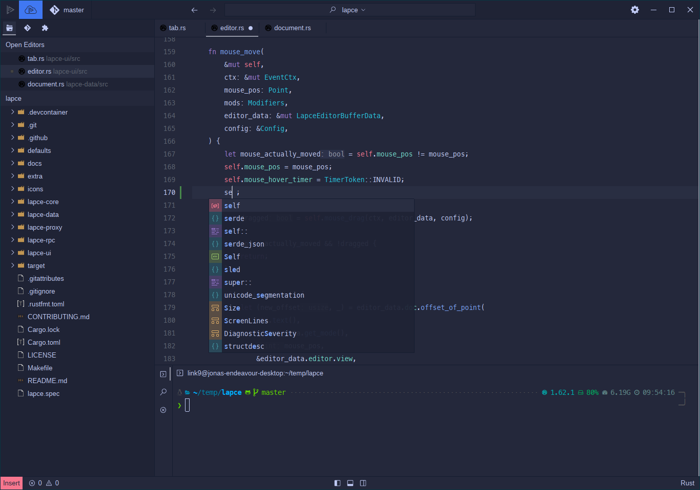

# 🏙 Tokyo Night
A dark and light Lapce theme ported from the Visual Studio Code [TokyoNight](https://github.com/enkia/tokyo-night-vscode-theme) theme 
and highly inspired by the great [Tokyo Night Neovim](https://github.com/folke/tokyonight.nvim) theme by folke.

Currently it includes only the TokyoNight Storm variant. The TokyoNight Night and TokyoNight Day theme are planned.

## Storm

